# Analyzing the DC Transfer Function

- Assume $I_{ds,sat,n} = I_{ds,sat,p}$; $V_{th,n}$ = $V_{th,p}$ = 200mV

- Linear region $(V_{gs} > V_{th}; V_{ds} < (V_{gs} - V_{th}))$:

$$I_{ds,linear} = \mu C_{ox} \frac{W}{2L}[2(V_{gs} - V_{th})V_{ds} - V_{ds}^2]$$

- Saturation region ($V_{ds}$ $\ge$ ($V_{gs} - V_{th}$)):

$$I_{ds,sat} = \mu C_{ox} \frac{W}{2L}(V_{gs} - V_{th})^2$$

- $C_{ox} = \frac{\epsilon_o\epsilon_{ox}}{t_{ox}}$

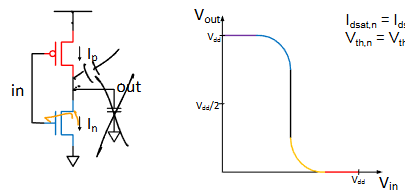

- Assume load is capacitive (No steady-state current draw)

- Voltages are dc (Amount of capactive load is irrelevant)

## Inverter DC analysis

- Devices operate over a variety of modes across voltage range

- Governing equation: **Pullup current == Pulldown current**

    - $I_{NEFT}(V_{gsn}, V_{dsn}, V_{thn}) = I_{PEFT}(V_{gsp}, V_{dsp}, V_{thp})$

    - where $V_{gsn} = V_{in}$, $V_{dsn} = V_{out}$; $|V_{gsp}| = V_{DD} - V_{in}$, $|V_{dsp}| = V_{DD} - V_{out}$

- Both equation-based and graphical analysis is valuable

- Useful in determining robustness to noise (Static Noise Margin/Holding Res)

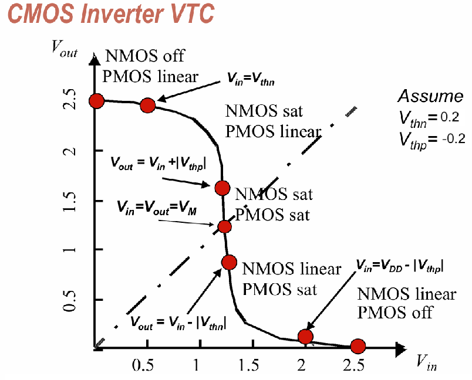

## Further Discussions:

### 1. If both Vthp and Vthn increase to 0.4V, how does the curve look like?

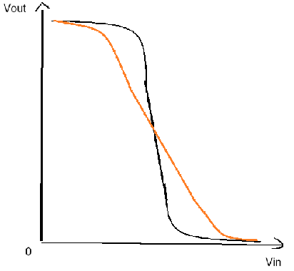

- More flat

- Same Vm

### 2. If $I_{dsat,p} = 2I_{dst,n}$, how does this curve look like?

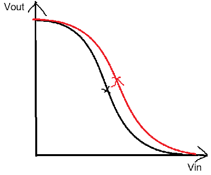

- Stronger PMOS

### 3. If $|V_{thp}| > |V_{thn}|$, how does this curve look like?

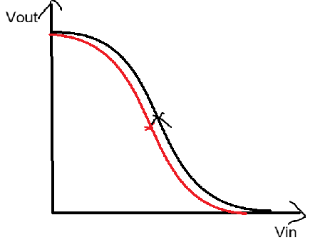

- Weaker PMOS

In short, **Stronger PFET** => **Difficult high-to-low transition** => **Higher Switching threshold (Vm)**

**Weaker PFET** => **Difficult low-to-high transition** => **Lower Switching threshold (Vm)**

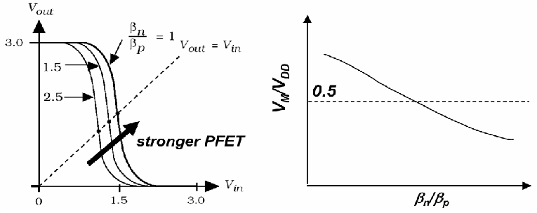

- Proper choice of $\beta_{n}/\beta_{p}$ is necessary to achieve a desired switching threshold (Vm)

### 4. If VDD = 1V rather 2.5V (|Vthp| = |Vthn| = 0.2V), how does the curve look like?

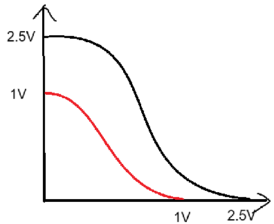

- $gain = \frac{\delta V_{out}}{\delta V_{in}}$

- **Noise margin decreases** (Noise Effect increases)!

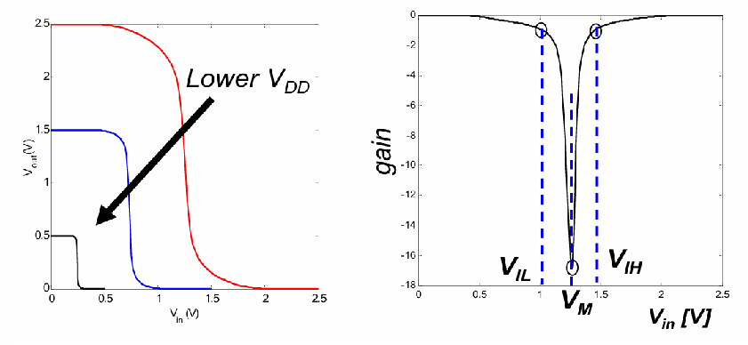

- Once VDD < Vth, the Inverter now becomes a **Subthreshold Inverter**

VTC is obtained from:

$$I_{subthP} = I_{subthN}$$

$$I_{0P}e^{\frac{VDD - V_{in} - |V_{thp}|}{n_pKT/q}} = I_{0N}e^{\frac{V_{in} - V_{thn}}{n_nKT/q}}(1 - e^{\frac{qVout}{kT}})$$

we know that, $$I_{D} = I_{0}e^{\frac{q(Vgs - Vth)}{nKT}}(1 - e^{-\frac{qV_{DS}}{KT}})$$

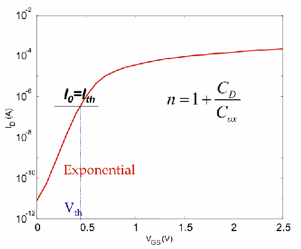

- A pratical definition of $V_{th}$: $V_{gs}$ necessary to obtain a pre-defined current ($I_{th}$)

- A commonly used value: $I_{th} = 300nA \times (W/L)$

**Sub-threshold Slope**

Subthreshold Slope (S) is defined as the $\Delta V_{gs}$ required for 1 decade change in $I_{D}$

$$\frac{I_{D2}}{I_{D1}} = e^{\frac{q(V_{gs2} - V_{gs1})}{nKT}} = e^{\frac{q(\Delta Vgs)}{nKT}}$$

$$\Delta V_{gs} = \frac{nKT}{q}ln{\frac{I_{D2}}{I_{D1}}}$$

$$S = \frac{nKT}{q}ln(10) = \frac{KT}{q} ln(10) (1 + \frac{C_{D}}{C_{ox}})$$

Min $S = \frac{kT}{q}ln(10)$ ~60mV / decade (for n = 1) at room temp (T = 300K)

### 5. Sketch DC curve for circuit to this 'fake inverter' (Trick question)

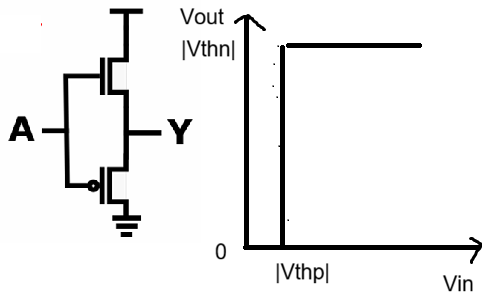

## Inverter Static Noise Margin

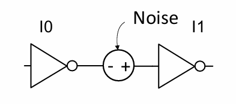

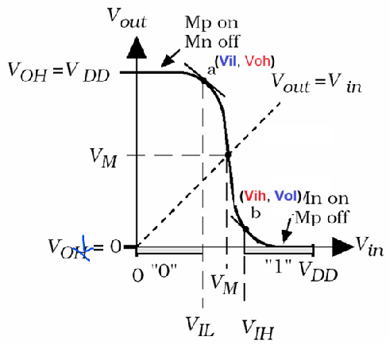

$$NM_L = V_{IL} - V_{OL}$$

$$NM_H = V_{OH} - V_{IH}$$

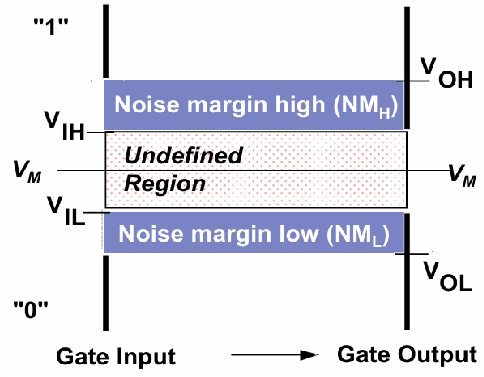

Best possible NM for an inverter:

- when the inveter is ideal, $V_{OH} = V_{DD}$, and $V_{OL} = 0$, and $V_M = VDD/2$

- the unity-gain points are symmetric, $V_{IL} \approx V_{DD}/2$ and $V_{OL} \approx V_{DD}/2$ 

- $NM_{L} = NM_{H} = V_{DD}/2$

### Logic Level Restoration in Cascaded Inverters

- **Restoration**: The process of "cleaning up" a signal so that it **returns to its full, intended voltages levels** after **its has been degraded**.

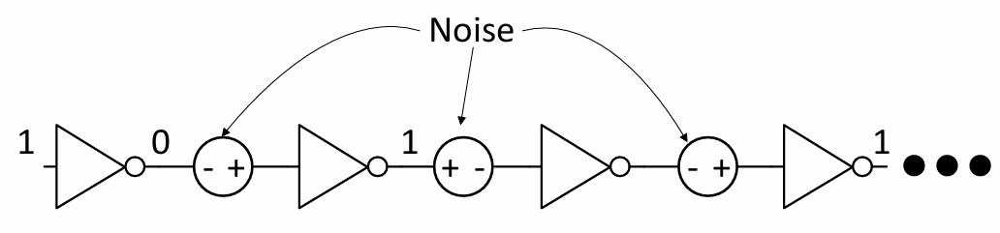

- Unity-gain points definte the Noise Margin (NM_L and NM_H)

- If noise voltage doesn't exceed noise margin, then it can restore to full swing after noise is applied.

- Once noise voltage exceeds the noise margin, then the next inverter could get 'erroneous logic' and case **digital error propogation**

# Crosstalk

## Crosstalk Model

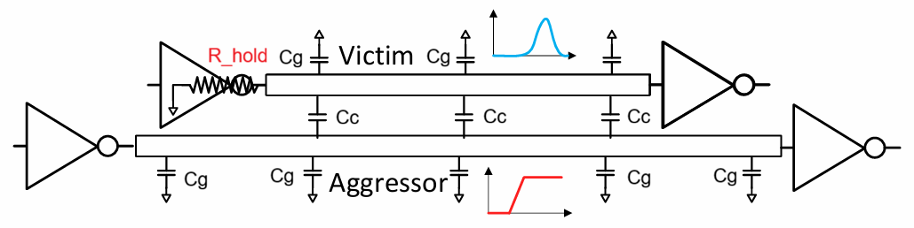

When *aggressor* switches, especially in a large slew rate, the charge will charge *victim* through **coupling capacitor**.

- $I_{coupling} = C_c\frac{dV_{agg}}{dt}$

- if aggressor has a very steep slew rate, $\frac{dV_{agg}}{dt} \neq 0$, the current will go thourgh victim node through coupling capacitor $C_c$.

### Simple Crosstalk Model

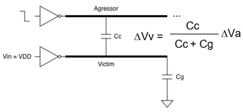

### Complex Crosstalk Model

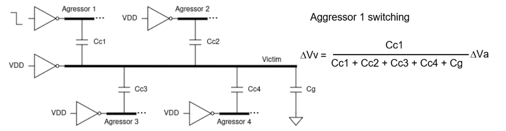

### Crosstalk Model with R_Hold

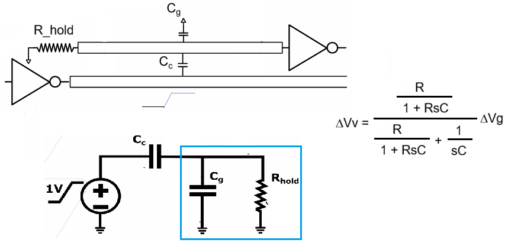

## Crosstalk Glitch

### Key glitch parameters

- Peak glitch amplitude $V_{peak}$

    - **The most important parameter**, because if it exceeds the receiving gate threshold, it can **false switching**

- Glitch width (duration) $T_{glitch}$

    - The time the glitch stays above certain threshold. Even if the peak is high, if the pulse is **very narrow**, the next gate might **filter it out**

### Relevant glitch-determing parameters

- Coupling/Parasitic capacitance $C_c$

    - $V_{glitch} \approx C_c$

    - Factors increasing $C_c \propto \epsilon \frac{A}{d}$ and $X_c \propto \frac{1}{2\pi fc}$

        - long parallel wires

        - small spacing

        - high clock frequency (for clock signal)

        - same metal layer (long parallel wires and samll spacing, the wires at different layer are orthogonal)

- Victim node capacitance $C_g$

    - Total Capacitance on the victim net: $C_v = C_{wire} + C_{load}$

    - Larger $C_g$ can help decrease $\Delta V_v$, vice versa

- Aggressor transistion time

    - $i = C\frac{dV}{dt}$, Fast aggressor edges $\rightarrow$ large $\frac{dV}{dt}$ $\rightarrow$ larger injected current

    - fast edge $\rightarrow$ larger glitch, slow edge $\rightarrow$ smaller glitch

- Static Inverter's **holding resistance**

    - When victim node is charged by aggressor, victim driver will try to get the value back to the original one, which is called **driver strength**, and is related to **holding resistance**

    - **Holding Resistance**: The equivalent resistance of the victim driver when maintaining the current logic value

        - When victim inverter originally is *logic 0* (PMOS off, NMOS on), then the driver strength depends on the *NMOS equivalent resistance*

        - When victim inverter originally is *logic 1* (NMOS off, PMOS on), then the driver strength depends on the *PMOS equivalent resistance*

    - Why *static*? Becuase this is a general / unverisal case and is independent of event

    - The approximate value of $R_{hold} \approx \frac{1}{gm}$
    
    - **Holding resistance impacts peak noise glitch**

        $$V_{glitch} \approx I_{coupling} \times R_{hold}$$

    - If driver is weak, then $R_{hold} \uparrow \Rightarrow V_{glitch} \uparrow$ and vice versa.

- Relative switching direction

    - If victim is switching simultaneously:

        - same direction $\rightarrow$ delay decreases

        - opposite direction $\rightarrow$ worst delay

## PVT effects of X-talk

### Voltage Effect

For the model with $R_{hold}$

- $V_{DD}\downarrow \rightarrow I_{coupling} \downarrow \rightarrow$ slew rate $\downarrow$

- But victim has **lower noise margins**

- If $V_{DD} \downarrow$, victim will has **higher** $R_{hold}$ $\rightarrow$ glitch peak $\uparrow$

So if only $V_{DD} \downarrow$, it hard to tell crosstalk could be better or worse.

- It usually needs to simulate through SI analysis tool

- **But in modern technology, the result of $V_{DD} \downarrow$, worse noise margin, weaker driver, higher $R_{hold}$, and glitch peak $\uparrow$ dominates**

### Something important about Packaging

- **Coupling is not restricted to on-chip -> impacts off-chip operation as well**

    - PCB / Cable / Board

- **Long runs of closely spaced wires with no ground-plane/coupling around are worst**

    - Clock buffer tree / Segement into blocks

    - **Shielding**: add a protect VSS wire between two long / high frequency wires

- **Use Schmitt Triggered inputs (hysteresis) to suppress crosstalk**

    - It has two thresholds ($V_{th+}, V_{th-}$) for rising and falling edge.

    - Avoid the errors when we have noise input signals, especially when generating square waveform

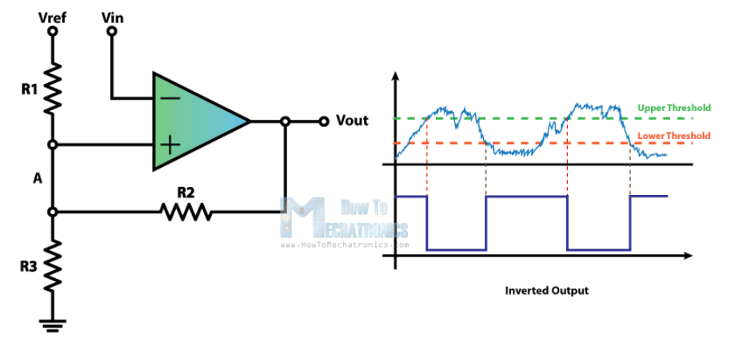

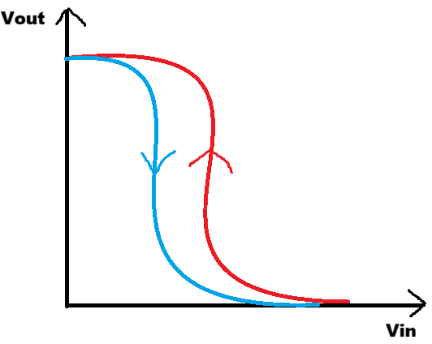

# Power Delivery

## Margins in Design

### Clock Jitter

- Cycle to cycle jitter

    - 1st cycle period: 1ns; 2nd cycle period: 1.02ns; 3rd cycle period: 0.98ns 

- impacting factors: PLL + clock tree

    - PLL factors: VCO noise, Power noise, reference jitter

    - Clock tree: buffer noise, supply noise, crosstalk, routing variation

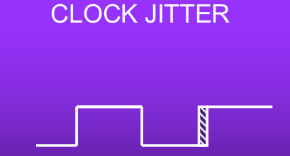

### Coupling Noise

- Capacitive coupling between nets

    - especially for long wires and short spacing

- worset scenario: victim & aggressor are both switching

    - same direction, delay decreases

    - opposite direction, delay increases

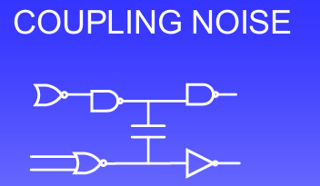

### Temperature

- Transistors

    - $I_{sat} = \mu C_{ox}\frac{W}{2L}(V_{gs} - V_{th})^2$

    - Temperature (T) $\uparrow$ $\rightarrow$ current mobility ($\mu$) $\downarrow$, voltage threshold ($V_{th}$) $\downarrow$

    - In modern technique node, **Low Temperature will lead slower transistor**

    - -40°C could be the worst case

- Interconnects

    - $R(T) = R_0(1 + \alpha T)$

    - Temperature (T) $\uparrow$ $\rightarrow$ $R_{wire} \uparrow$ $\rightarrow$ RC delay $\uparrow$

    - 125 °C could be the worst case

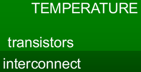

### Voltage

- VRM (Voltage Regulator Module) offset

    - PMIC could have DC offset, e.g., $1.0V \rightarrow 0.98V$

- Regulator Noise and Response

    - CPU switching $\rightarrow$ Current changes suddenly $\rightarrow$ Regulator responses not immediately $\rightarrow$ VDD variates

- IR drop

    - If the current is large in some area, $V = I \times R$, voltage drops

- Inductance Drop

    - $V = L\frac{di}{dt}$

    - when multiple transistors switching $\rightarrow$ $\frac{di}{dt} \uparrow \rightarrow$ voltage drop $\uparrow$ 


### Process

- global corners

    - the entire wafer is fast or slow

    - FF: fast transistor, TT: typical, SS: slow transistor

- local mismatch

    - The different area of one single chip could be different

    - Clock skew, timing variation

- device + wire

    - transistor

    - metal width, metal thickness, via resistance

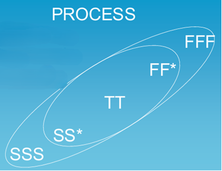

### Safety Margin

- human nature

- 2nd / 3rd order effects

- "unkown unkowns"


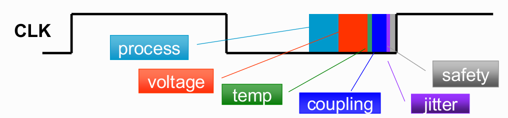

## Design Margin Taxonomy

Here are some noise factors we need to reserve margins for when we are designning the system

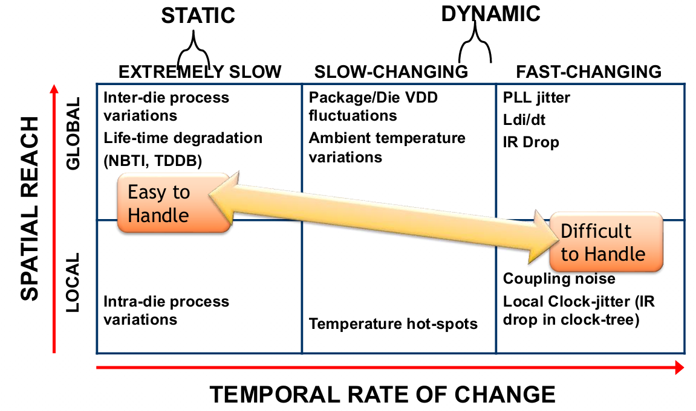

- Usually, in terms of temporal rate of change, **dynamic noise is harder to handle**; in terms of spatial region, **local noise is harder to handle**

## Energy-Efficient Design: Traditional Approaches

### Industry: Other approaches prioritized till recently

- Continued sacling

    - Dennard scaling

    - Smaller technology node, smaller capacitor, samller supply voltage

- Clock gating

    - reduce flipping activity factor $s$ to reduce dynamic power

- Power gating

    - reduce leakage current and static power consumption

- DVFS (Dynamic Voltage and Frequency Scaling)

    - Dynamically control voltage and frequency

    - e.g., when CPU is idle, let voltage drops from 1.2V to 0.9V, frequency drops from 3GHz to 1.8GHz

- Multi-Vth

    - critical path, low Vth

    - non-critical path, high Vth

### Academia, focus on more exotic approaches

- Adiabatic logic / Charge-recycling techniques

- Super-pipeling (voltage-scaling)

    - Decrease logic path/delay and increase clock frequency, as a result, reduce voltage to achieve same performance

- Low-power logic topologies

    - Pseudo-NMOS logic

    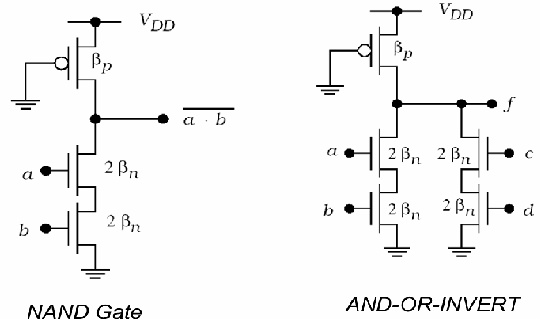

    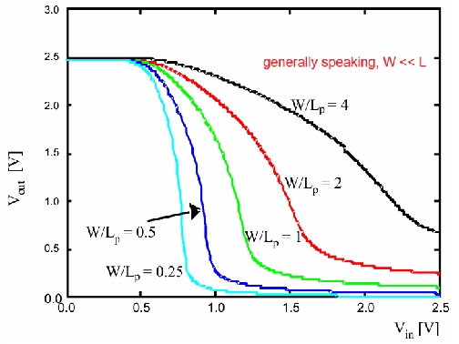

    - Pass-transistor

    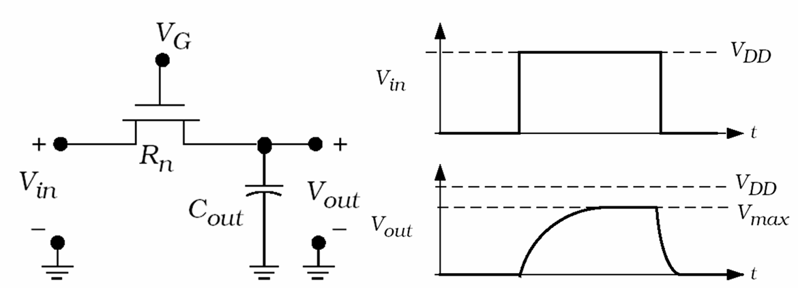

    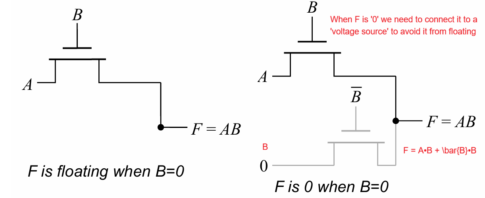

    - Transmission-gate

    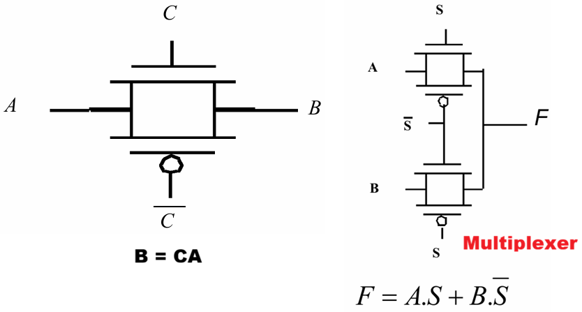

    - Dynamic logic

    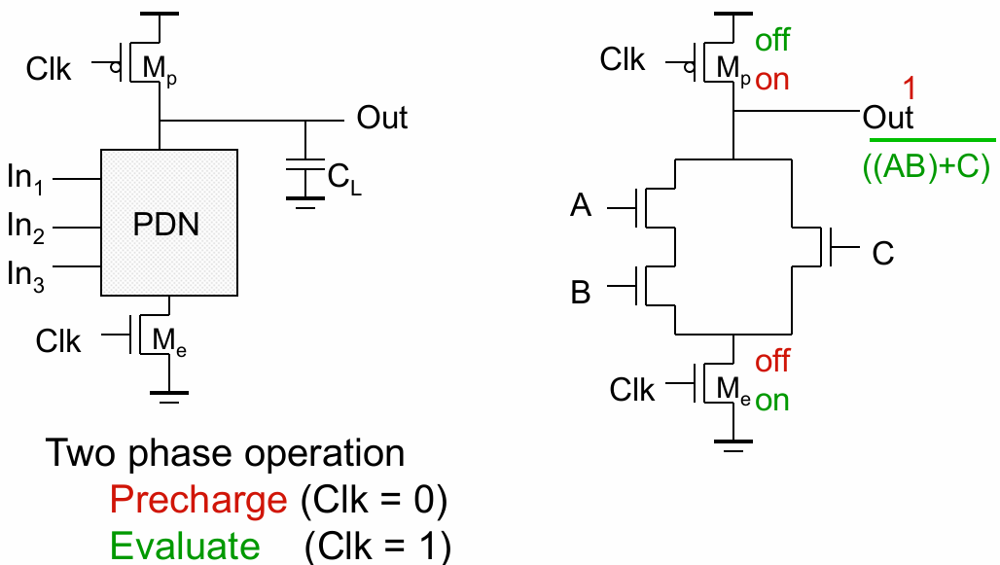

    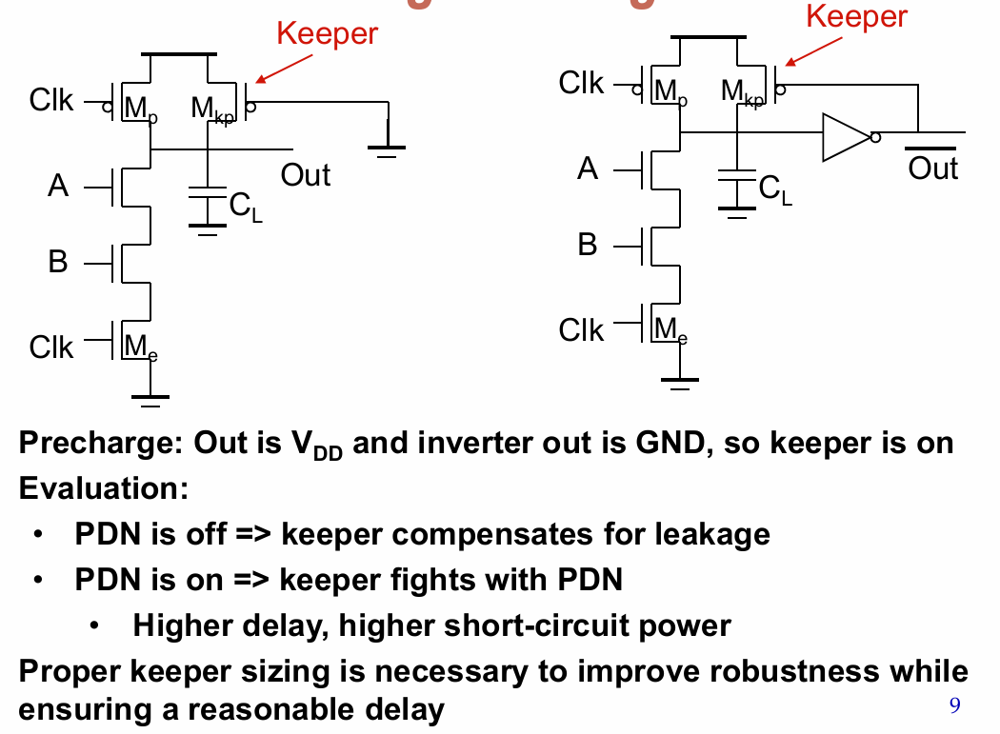

    - Domino logic

    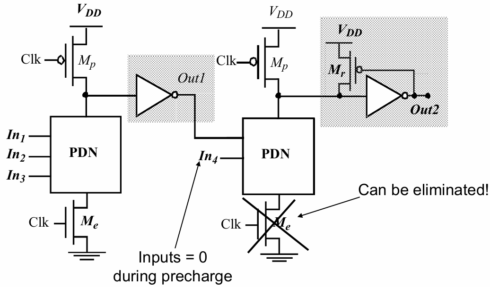

## Voltage Margins: Challenge Perceptions

### Industry

- Traditionally recognized importance but until recently, not addressed as a design problem

- Mitigated using **binning** and **test**

    - good chip $\rightarrow$ low voltage and high frequency

    - bad chip $\rightarrow$ high voltage and low frequency

    - If timing is unstable, increase voltage and decrease frequency

    - **Remediate through operating conditions rather than fixing from design**

### Academia

- Largely unheralded

- Not seen as highly impactful effort in low-power design

### Reality

- Dominant source of inefficiency

- Voltage Margin

    - PVT variation

    - IR drop

    - Supply noise

    - Process variation

    - Temperature

- Solutions (particularly supply noise) span variety of areas

    - PDN design

        - Power Grid

        - decoupling capacitors

        - IR drop reduction
    
    - Voltage Regulation

        - VRM (Voltage Regulator Module)

        - on-chip regulator

        - LDO (Low-Dropout)
    
    - Clocking

        - adaptive clocking

        - dynamic timing margin
    
    - Micro-architecture

        - Error Recovery

            - e.g., SRAM/DRAM soft error use (Error Correcting Code(ECC)) to correctify
        
        - Razor Flip-flop

            - detect timing error (cache side effect in exception handle)

## PDN and Supply/Power Noise in Modern SoCs

### High Performance Design

When $P_{supply}$ keeps unchanged, to improve the performance ($delay \propto \frac{V_{DD}}{(V_{DD} - V_{th})^{\alpha}}$)

- $V_{DD} \rightarrow \alpha V_{DD}$ 

- $I_{DD} \rightarrow \frac{I_{DD}}{\alpha}$

- $Z_{targ} \rightarrow \frac{\alpha V_{DD}}{\frac{I_{DD}}{\alpha}} = \alpha^2 Z_{targ}$

To keeps $Z_{targ}$ as small as possible, now **the PDN has to much stronger, allowing smaller impedence than before**.

- e.g. Allow 50 $m \Omega$ in PDN, for high performance design, now only allow 10 $m \Omega$

### Low Power Design

For Low Power Design, we usually want to reduce leakage current

- $V_{th} \uparrow$ and $V_{DD} \downarrow$

- delay sensitivity to supply noise $\uparrow$

- voltage-domain count $\uparrow$

    - e.g., CPU core 0.8V, GPU 0.9V, SRAM 0.7V, IO 1.2V

- PDN becomes much complex, and noise coupling increases

**Supply noise significantly impacts performance**

In summary, Supply/Power Distribution Network (PDN), and Supply Noise (SN) become critical in Modern SoCs

## PDN Delivery Network

The target of design Power Delivery Networks (PDN) is **Flatten the PDN impedence profile and keep it below $Z_{target}$**, Not impedence matching.

Three domains:

```
VRM -> PCB -> Package -> Chip
```

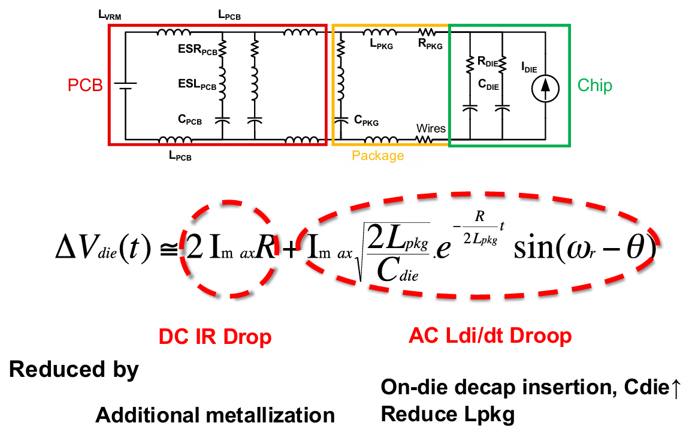

There are two main Droop components:

- **DC IR Droop** (DC part - lead by IR drop: V = IR)

    - Reduced by Additional metallization

- **AC Ldit/dt Droop** (Dynamic part - lead by inductance and capacitance of RLC response)

    - Voltage droop: $V = L\frac{di}{dt}$

    - Resonant happens because: **Package Inductance $L_{pkg}$** and **On-die decap $C_{die}$**

    - **On-die decap insertion**
    
        - $C_{die} \uparrow$, providing transient current, working like a 'local battery'

    - Reduce $L_{pkg}$

        - shorter path, flip-chip, more bumps

AC Droop is very dangerous:

- lead to undershoot / overshoot

- easily to lead to timing violation / crash

### Decap Parasitics

Why do we actively insert Decaps into die, package, PCB?

- Current varies very very quick, but power supply is far away from the source

- In some scenarios, millions of gates switching simultaneously, and current increases from 1A -> 20A

- If we don't have decaps, the long path which has large inductance L, will lead $V = L\frac{di}{dt}$

- Voltage drops suddenly, and leads to timing violation / crash

- Using decap which works as a small battery near loads

    - In ns, VRM cannot responses to the suddenly increased current demand, and decap will discharge

    - In us, VRM will gradually supply the current, and decap will charge as well

Why do we have different decaps ($C_{die}$ on Chip, $C_{pkg}$ on package, $C_{PCB}$ on PCB) on different positions?

- On-die decap is the capacitor which is most close to the loads, and has the fastest response, in GHz

    - To solve high-frequency noise / fast $\frac{di}{dt}$

- Package decap is the middle one that close to the loads

    - To solve the middle-frequency noise (1 MHz to 100MHz)

- PCB decap is the farest one that close to the loads, and also has the largest capacitance

    - To solve low-frequency and large current variations (kHz to 1 MHz)

However, **decap is not an idealy passive component**, So it will have **Equivalent Series Resistance (ESR)** and **Equivalent Series Inductance (ESL)**

- A true impedence of decap is **$Z(\omega) = ESR + j\omega L + \frac{1}{j\omega C}$**

- When frequency increases, $Z_L = j \omega L \uparrow$

## Supply Impedence and Noise

### Frequency Domain

The object is to minmize (max[Z])

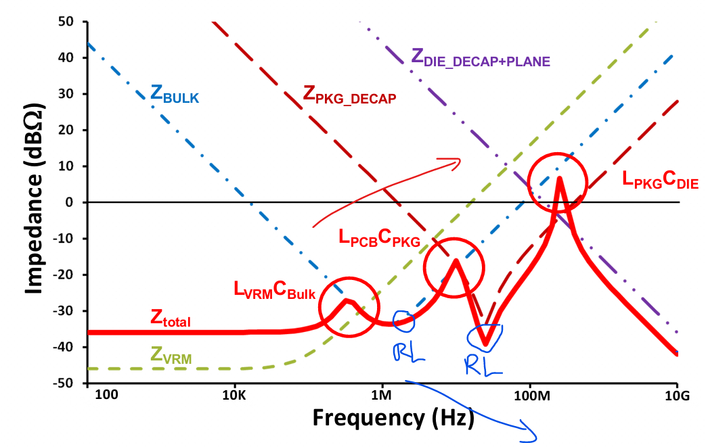

- In low frequency, capacitor dominates and leads impedance reduces

- In high frequency, inductor dominates and leads impedance increases

- Three key resonant points:

    - $L_{VRM} C_{BLK}$

    - $L_{PCB} C_{PKG}$

    - $L_{PKG} C_{DIE}$

- **Resonance (Valley)**

    - in-series resonance

    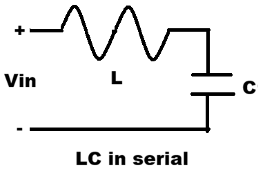

    - $Y_L + Y_C = 0$ -> $Z_L + Z_C = 0$

    - $j\omega L + \frac{1}{j\omega C} = 0$

    - $\omega = \frac{1}{\sqrt{LC}}$ or $f = \frac{1}{2\pi \sqrt{LC}}$

- **Anti-resonance (Peak)**

    - in-parallel resonance

    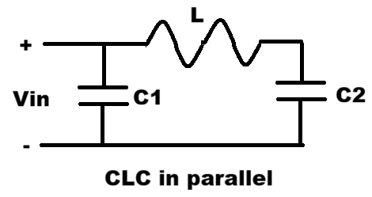

    - $Y_{C1} + Y_{L, C2} = 0$ -> $Z_{C1} + Z_{L, C2} = 0$

    - $\frac{1}{j\omega_{anti} C1} + (j\omega_{anti} L + \frac{1}{j\omega_{anti} C2}) = 0$

    - $\omega_{anti} = \sqrt{\frac{C_1 + C_2}{LC_1C_2}}$

    - **Key issue: C vs C cancel current** (In input source's perspective, cannot see the current, impedence infinity)

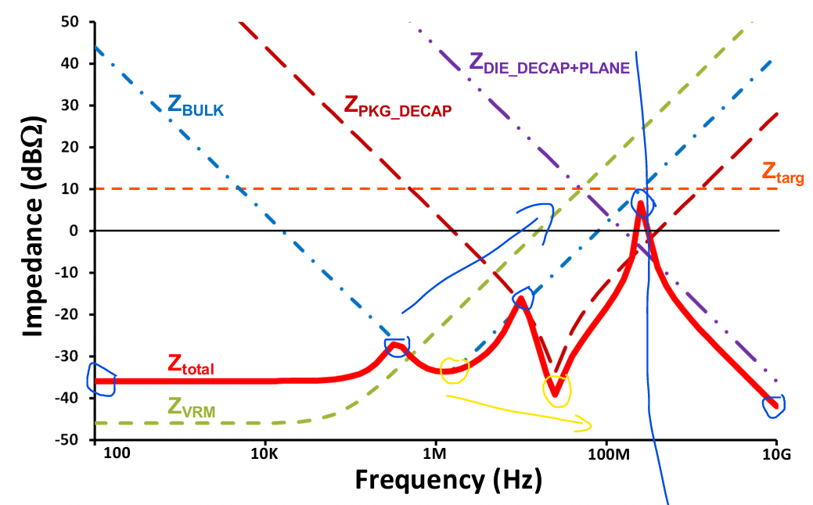

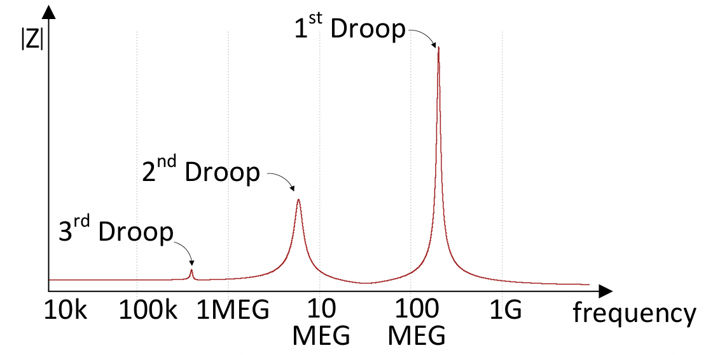

### Time Domain

In the time domain, **anti-resonance sets the amplitude, resonance sets the frequency**

- anti-resonance will amplify the variations at some frequency (larger droop)

- system oscillates at the resonance frequency, lead to the rining at time domain

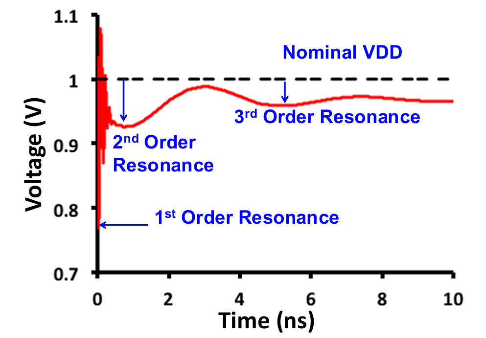

- 1st Order Resonance: usually leads by **package inductance** $V = \frac{di}{dt}$ and **chip on-die parasitic cap**. 

- 2nd Order Resonance: usually leads by **package inductance** and **on-die decap**

- 3rd Order Resonance: usually leads by **PCB inductance** and **package decap**

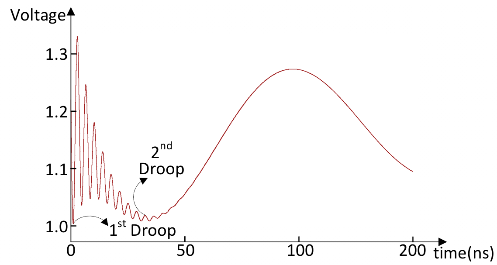

- The system is actually a step response of RLC system

- 1st Droop is the earliest and most critical voltage drops

- Faster Ramp -> larger first droop

## Methods to mitigate droop:

### High-density Decap

**Deep Trench Capacitor (DTC)**

- Leveraging: Vertical Structure $\rightarrow$ Extremely high area efficiency

- Essence: Placing an ultra-large capacitor in very close proximity to the transistor

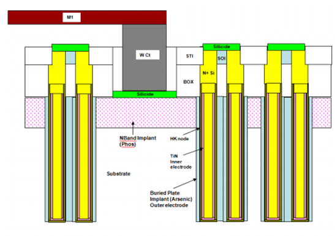

- Decoupling capacitors (Decaps) are implemented in the top metal layers (M8/M9)

- VDD and VSS rails are interleaved

- Via connections are densely packed

- Forms a distributed decoupling capacitor network

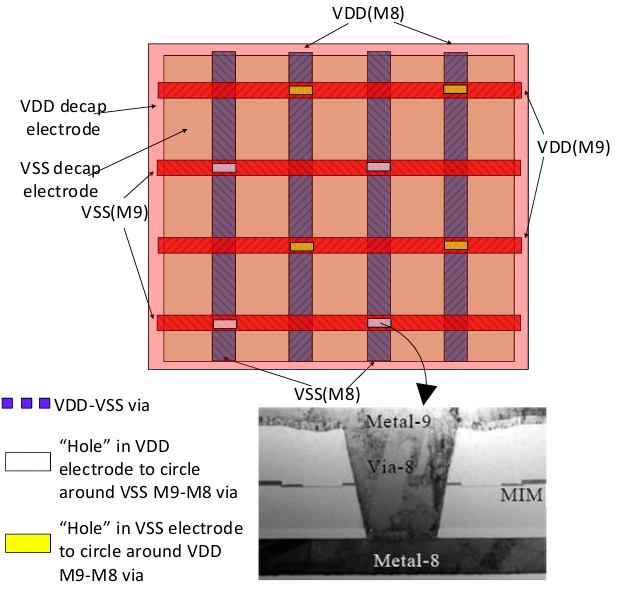

Such a design makes **1st droop slower, less significant**

- $V = \frac{1}{C} \int_{}^{} i \,dt$

But **2nd droop can be significant but easier to manage**

**High-K Dielectrics**

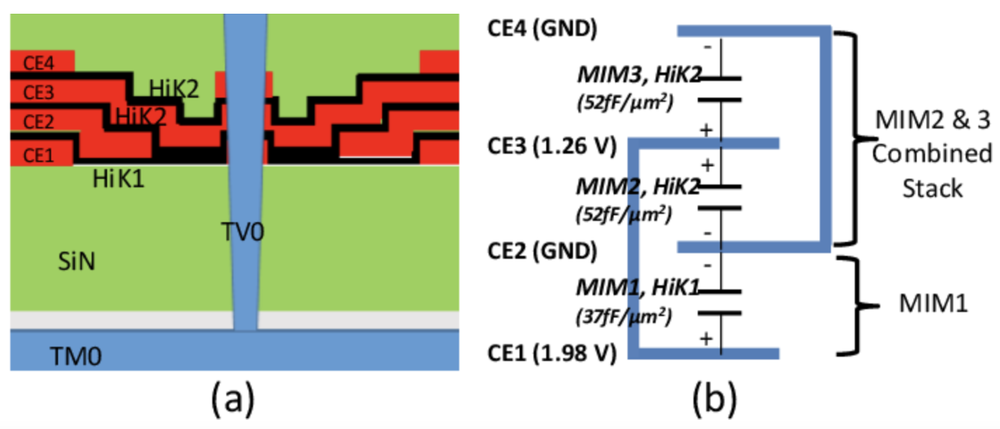

- multiple capacitors in serial / parallel

- different voltages 

- "Stack" capacitors vertically to increase density.

- Pros: MIM cap 500 fF/μm²

- Cons: Significant ESR, which could leads to larger IR drops

### Mircoarchitecture - Instruction Throttling

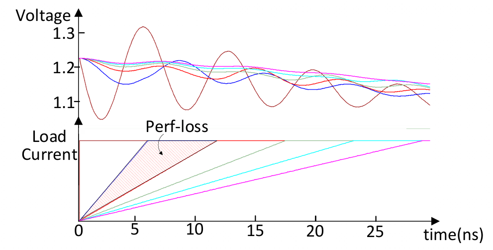

**Instruction Throttling**

- Graduatlly fill compute pipeline (e.g., after a cache miss)

- Slow ramp-up -> slow current build-up ($\frac{di}{dt}$)

- Strongly disminishes 1st droop

- Minor performance impact

But there are also some limitations of Throttling

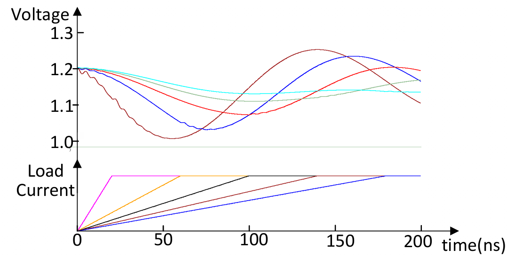

- Throttling for 2nd droop requires very slow ramp-up

- Significant performance loss. May be ill-suited to some applications

### Even more worse in pulse response rather than step response

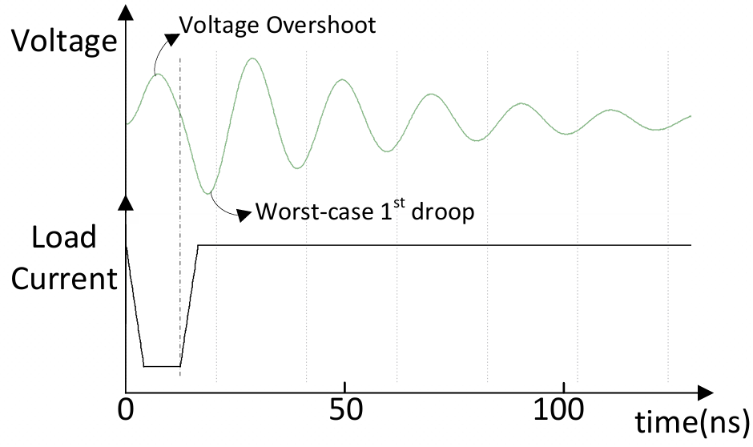

- Step load does not cause worst case droop

- Pulsed load can result in larger margin requirement

    - Especially if 1st droop dominates

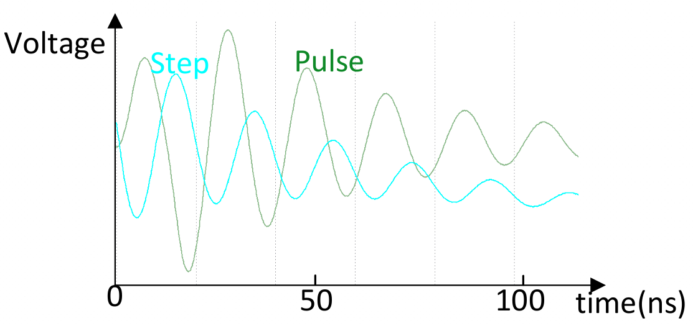

**Persistent Pulsing**

Cyclic loads (Persistent pulses) induce **package resonance**, resulting in severe voltage fluctuations.

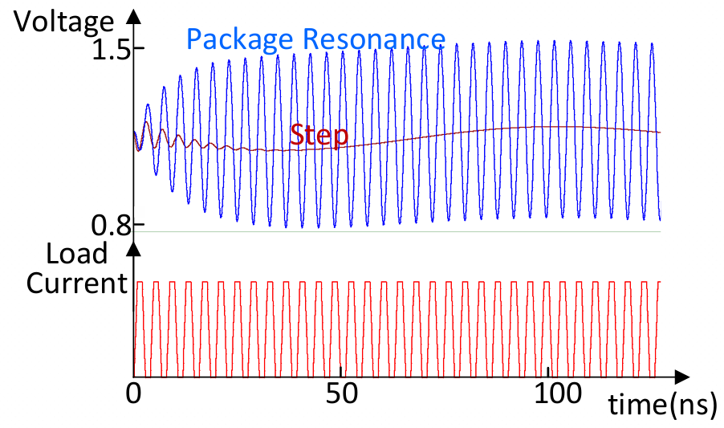

- When pulse frequency approaches the resonant frequency of PDN, energy accumulation and large oscillation

- High reliability and robustness impact

So here is a whole strategy to handle the supply noise

|Droop                | Solutions                             |
|---------------------|---------------------------------------|
|1st (high frequency) | on-die decap + instruction throttling |
|2nd (Media frequency)| package decap                         |
|3rd (low frequency)  | PCB + VRM                             |

## Integrated Voltage Regulation Module (VRM)

### Off-chip Voltage Regulation Module

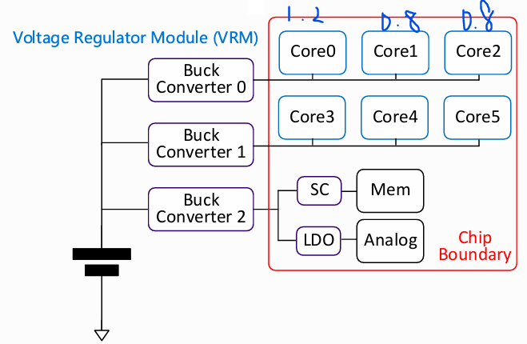

- The energy-efficiency demand requires **spatio-temperal $V_{DD}$ scaling** (DVFS)

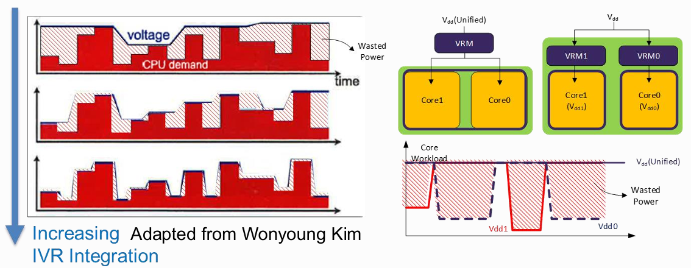

- Off-chip regulators overwhelming in use today have several issues below:

    - Area-cost

    - PDN degradation (per-domain)

    - Slow transient response (Control far away from load)

### Integrated Volatge Reguation Moudle

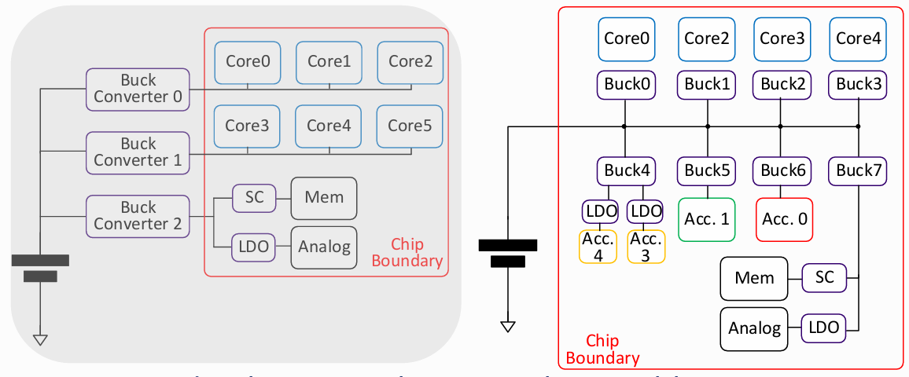

- **Buck**

- **Low-Dropout Regulators (LDO)**

- **Switched-Capacitor (SC)**

- Advantages in resolution, speed, pin-count, board-area

### Integrated Voltage Regulation (Buck)

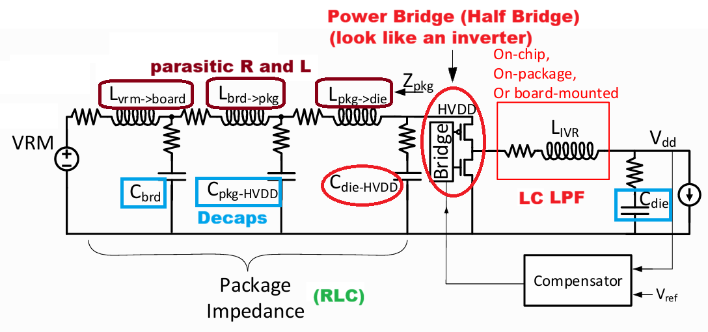

|Pros                                          | Cons                                  |
|----------------------------------------------|---------------------------------------|
|Enhanced DVFS (spatio-temporal) ($ns$~$\mu$ s)| 2-stage Converter for Li-cell devices |
|Board Size / Cost reduction                   | Lower Converter efficiency (switching loss, gate driving loss, conduction loss)|
|Lower input Current draw ($P = VI$, HVDD, $I \downarrow$)| Line-side supply noise     |

**Intel Haswell (FIVR)**

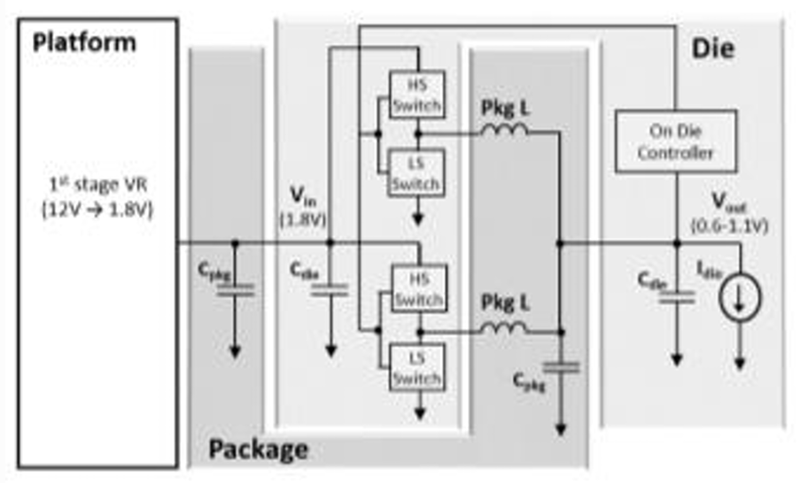

- **2-stage regulator**

    - PCB (Coarse grain)

    - Package (Fine grain)

    - faster response, support DVFS

- **Inductors built on package layer**

    - $V = L \frac{di}{dt}$, L can be smaller and current response is faster

    - droop is smaller

- **Decap offered by on-chip MIMCAP (Metal-Insulator-Metal capacitor)**

    - smaller size, high frequency current response, samller ESR/ESL

    - suppress high-frequency noise, supply transient current, stabilize VDD

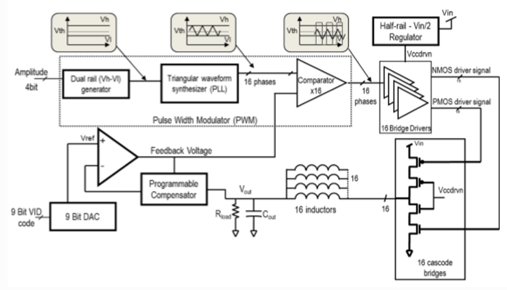

- 16-phase operation, 140 MHz switching frequency

    - 16 Parallel Buck Converters, reduce L

    - **Each phase is interleaved**, current sharing

- **Phase-shedding** to optimize efficiency across load 

    - Dynamically shut down some phases based on the load

**Phase Shedding**

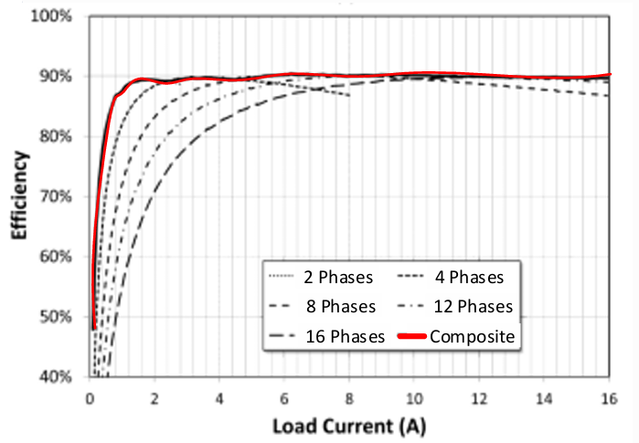

- Processors feature large dynmaic current range

- Dynamic phase-shedding to achieve optimal efficiency across load-range

    - Light load (left): 2-phase has the highest efficiency, 16-phase has the smallest efficiency

    - Heavy load (right): 16-phse has the highest efficiency, 2-phase has the samllest efficiency

- Peak Efficiency ~ 90 %
    
- Reason: Two types of Loss, Switching Loss and Conduction Loss

    - Swicthing Loss $\propto$ number of phases

    - Conduction Loss $\propto$ $I^2$

    - Light load: reduce phase (reduce Switching Loss)
    
    - Heavy Load: increase phase (current sharing, reducing current and conduction loss)

**Inductor Integration**

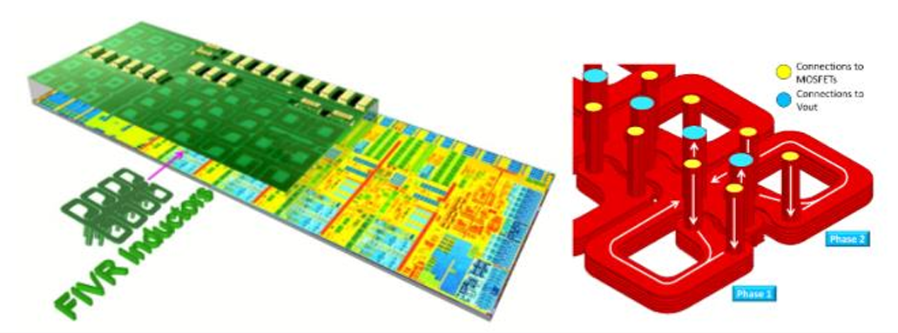

**Inductor windings distributed over individual voltage domain**

- Improved granularity

- Relief in bump current density

- Winding orientation to exploit mutual inductance

### Linear Regulators (Low Dropout, namely LDO)

An LDO is a linear voltage regulator that "uses a transistor as a resistor" to control Vout via feedback, but it directly "burns off" the excess voltage.

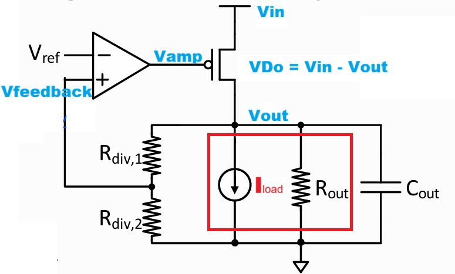

Here are four critical components:

- Error Amplifier 

    - Inputs: $V_{ref}$ and $V_{feedback}$

    - Output $V_{amp}$ controls the gate of Pass Gate (PMOS)

- Pass Transistor

    - It works as a adjustable/variable resistance

- Feedback (Positive Feedback through Resistance)

    - $V_{feedback} = V_{out} \times \frac{R_{div,2}}{R_{div,1} + R_{div,2}}$

- $C_{out}$

    - stabilize

    - suppress transient noise

Final result: $V_{out} \approx V_{ref}$

But the biggest issue is the **energy efficiency**

The loss efficiency at PMOS comes from (s is the switching factor):

$$I_{PMOS} = \frac{1}{2}s C V_{out} f$$

$$Q_{PMOS} = \frac{1}{2}s C V_{out}$$

$$E_{PMOS} = \frac{1}{2}s C V_{out} V_{in}$$

$$\eta' = 1 - \frac{\frac{1}{2}sCV_{out}V_{in}}{\frac{1}{2}sCV_{in}^2}$$

$$\eta' = \frac{V_{in} - V_{out}}{V_{in}} = \frac{V_{DO}}{V_{in}}$$

The LDO efficiency is:

$$\eta = \frac{V_{out}I_{load}}{V_{in}I_{load}}$$

$$\eta = \frac{V_{out}}{V_{in}}$$

Key parameter: 

$$V_{DO} = V_{in} - V_{out}$$

Try to make this difference as small as possible, to improve the efficiency

Usage: Analog, PLL, RF

| Pros                        | Cons                          |
|-----------------------------|-------------------------------|
| Fast Regulation (Response)  | Not so Efficient              |
| Low Aread Overhead (No L, C)| Weak current driving strength |
| Small Noise (clear power)   | Power / Thermal bottleneck    |

**LDO stability**

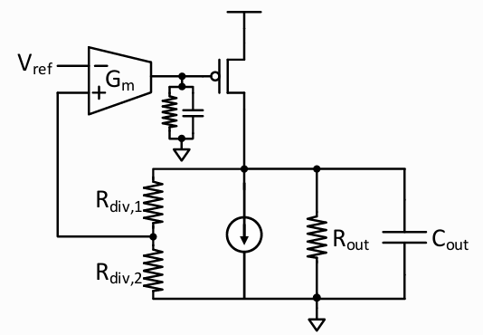

On-chip Implementations typically feature dominant error-amplifier output pole

- Stability challenges at low current (High $R_{out}$) configurations

- Require careful componsation techniques to maintain stability

    - ESR zero compensation

    - Internal dominant pole compensation

    - Adaptive biasing (control gm)

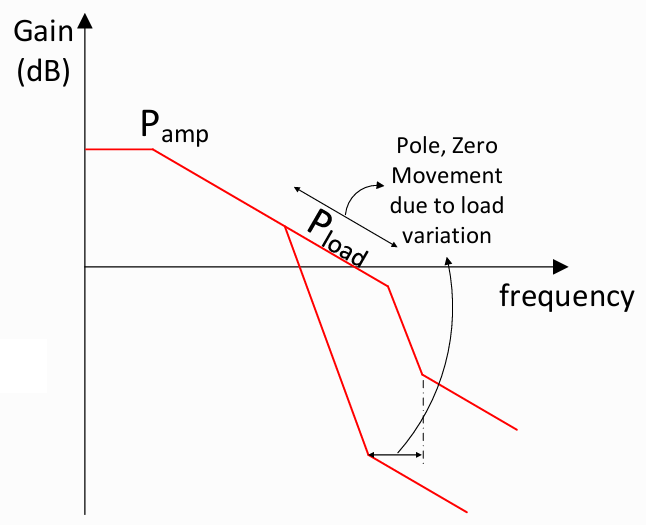

**$P_{amp}$: error amplifier's pole** (dominant pole)

- Output at the gate of pass transistor

- Usually, it's the low-frequency dominate pole

- It decides the basic stability of the whole system

**$P_{load}$: load's pole** (sensitive pole)

- $f_p = \frac{1}{2\pi R_{out}C_{out}}$

- When $R_{out} \uparrow$, $I_{load} \downarrow$, low load current, $P_{load}$ moves to $P_{amp}$, Phase Margin decreases

- When $R_{out} \downarrow$, $I_{load} \uparrow$, high load current, $P_{load}$ moves away from $P_{amp}$, Phase Margin increases

**Digital LDOs**

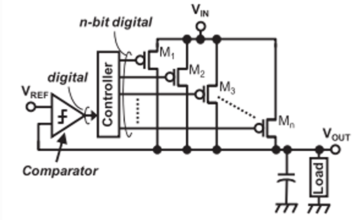

Digital LDO actually is a discrete-time feedback system

- Comparator

- Digital Controller

    - multiple-bits control

    - more smooth

- Multiple pass transistors

    - reduce step size

    - interleaving

    - improve response speed

Challenges

- Transient Droop

    - The control is discrete and cannot adjust transiently

- Limit cycle / ripple

    - Comparator + quantization will oscillate

- Delay problem

    - comparator delay

    - digital logic latency

Recently receiving a lot of attention for SoC applications

- Consistent with largely digital workflow

- Potentially easy to port across designs and process tech.

